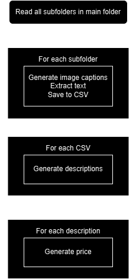
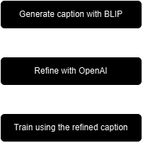

# Multi-Domain Image Identification & Description

The project consists of analazing images of one object (various types of transport and industrial equipment). Photos of both outside and inside parts were included, as well as documents. The end goal is to generate a structured markdown report, including the price estimation of the asset. 

## The logic is divided into 3 blocks:

1. **Caption generation**: For each folder, process images from each subfolder and generate captions

2. **Description generation**: For each subfolder generated captions, combine them for a full description of a collateral object

3. **Price Estimation**: Taking in consideration the description, estimate the price of the object

Here's the flowchart for the logic:



## Caption Generation

There are multiple files that use different models for caption generation and text extraction:

1. BLIP + YOLOV8-SEG + SAM + EASYOCR
2. GPT-4 Turbo

### 1. BLIP + YOLOV8-SEG + SAM + EASYOCR

All the ones that are named finetuned\* employ BLIP + YOLOV8-SEG + SAM + EASYOCR.

To start training, run `finetuned_main.py`. It works by calling training loop located in `finetuned_training.py`. 

First, it will download models defined in `finetuned_model_loader.py`. All of them are extracted from `Hugging Face`, except for `yolo_model` and `sam_checkpoint` (those need to downloaded separately and stored locally, see the file for which models are used).

Then, it would look for `annotations.md` (assuming we're provided with a markdown file with examples of end annotations, stored in the same folder as images). Furthermore, it looks up for `refined_captions` stored locally, if not present, they will be generated further. 

#### Segmentation

We generate segmentations (if not present) and store them locally. They are needed in order for the model to focus on the main area of interest and filter out background noise.
Check `finetuned_image_utils.md` for coding logic (temporarly comments are not present due to need to merge with another branch). 

We didn't implement segmentation for training, only for testing, so our finetuned checkpoint version was only trained on full images.

#### Caption Generation - Training

We finetune BLIP for beter caption prediction. The one that we use is base one. However, we believe better results can be achieved if using large version OR `BLIP-2` models.

Training is done in 2 epochs (to not overfit). Ground truth captions are generated by combining generated caption and prompting LLM model (in ours case we used openai key and model provided by our university). Prompt is composed of generated caption and ground truth annotation for the folder the image is extracted from. Afterwards, loss is computed by comparing the generated and refined with LLM caption. After first epoch, all the ground truth are saved locally.



##### Finetuned BLIP checkpoint

`blip_finetuned.pt` is located in `finetuned_blip`

#### CSV generation

After training, use the finetuned model to generate captions and `EasyOCR` for text extraction. Save everything to csv files.

### 2. GPT-4 Turbo

Since `GPT-4 Turbo` doesn't allow finetuning, the API calls are used to prompt the LLM to generate captions and extract text. Works better than `EasyOCR` for text recognition and generates better captions than finetuned `BLIP`. Run `openai_captioning.py` to test.

## Description generation

Run `description_generator.py`. Takes as input csv files and outputs generated md files. LLM model is prompted for these purposes.

## Price Estimation

Run `valuation.py`. Takes as input md file and outputs updated md file with estimated. Web scrapping strategies are employed.

## Required Python Libraries

The following third-party libraries need to be installed to run this project:

- `torch`
- `transformers`
- `ultralytics`
- `easyocr`
- `spacy`
- `python-dotenv`
- `pandas`
- `openai`
- `numpy`
- `Pillow`
- `opencv-python`
- `csv`

### Installation

You can install all dependencies using pip:

```bash
pip install torch transformers ultralytics easyocr spacy python-dotenv pandas openai numpy Pillow opencv-python csv

```
